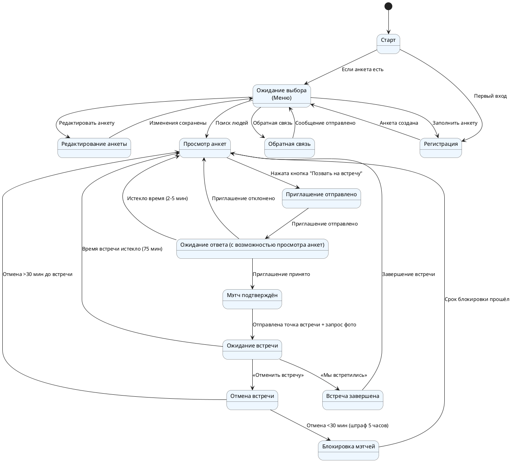

```plantuml
@startuml
skinparam backgroundColor #ffffff
skinparam shadowing false
skinparam defaultFontName "Arial"
skinparam state {
  BackgroundColor<<bot>> #eef7ff
  BackgroundColor<<user>> #fff6e6
  BorderColor #444
}

state "Старт" as Start <<bot>>
state "Ожидание выбора\n(Меню)" as MainMenu <<bot>>
state "Регистрация" as Register <<bot>>
state "Редактирование анкеты" as EditProfile <<bot>>
state "Просмотр анкет" as Browsing <<bot>>
state "Приглашение отправлено" as InviteSent <<bot>>
state "Ожидание ответа (с возможностью просмотра анкет)" as AwaitResponse <<bot>>
state "Мэтч подтверждён" as Matched <<bot>>
state "Ожидание встречи" as MeetingPending <<bot>>
state "Встреча завершена" as MeetingDone <<bot>>
state "Отмена встречи" as MeetingCancel <<bot>>
state "Блокировка мэтчей" as Blocked <<bot>>
state "Обратная связь" as Feedback <<bot>>

[*] --> Start
Start --> Register: Первый вход
Start --> MainMenu: Если анкета есть

MainMenu --> Register: Заполнить анкету
MainMenu --> EditProfile: Редактировать анкету
MainMenu --> Browsing: Поиск людей
MainMenu --> Feedback: Обратная связь

Register --> MainMenu: Анкета создана
EditProfile --> MainMenu: Изменения сохранены

Browsing --> InviteSent: Нажата кнопка "Позвать на встречу"
InviteSent --> AwaitResponse: Приглашение отправлено

AwaitResponse --> Browsing: Истекло время (2-5 мин)
AwaitResponse --> Browsing: Приглашение отклонено
AwaitResponse --> Matched: Приглашение принято

Matched --> MeetingPending: Отправлена точка встречи + запрос фото

MeetingPending --> MeetingDone: «Мы встретились»
MeetingPending --> MeetingCancel: «Отменить встречу»
MeetingPending --> Browsing: Время встречи истекло (75 мин)

MeetingCancel --> Browsing: Отмена >30 мин до встречи
MeetingCancel --> Blocked: Отмена <30 мин (штраф 5 часов)

Blocked --> Browsing: Срок блокировки прошёл

MeetingDone --> Browsing: Завершение встречи

Feedback --> MainMenu: Сообщение отправлено

@enduml
```