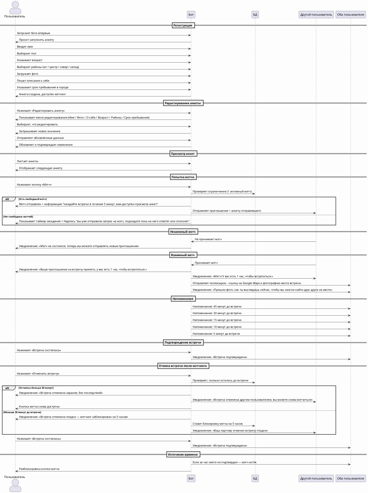

```plantuml
@startuml
skinparam backgroundColor #fdfdfd
skinparam shadowing false
skinparam arrowColor #333
skinparam actorStyle awesome
skinparam defaultFontName "Arial"

actor "Пользователь"
participant "Бот"
participant "БД"
participant "Другой пользователь"
participant "Оба пользователя"

== Регистрация ==
"Пользователь" -> "Бот": Запускает бота впервые
"Бот" -> "Пользователь": Просит заполнить анкету
"Пользователь" -> "Бот": Вводит имя
"Пользователь" -> "Бот": Выбирает пол
"Пользователь" -> "Бот": Указывает возраст
"Пользователь" -> "Бот": Выбирает районы (юг / центр / север / запад)
"Пользователь" -> "Бот": Загружает фото
"Пользователь" -> "Бот": Пишет описание о себе
"Пользователь" -> "Бот": Указывает срок пребывания в городе
"Бот" -> "Пользователь": Анкета создана, доступен мэтчинг

== Редактирование анкеты ==
"Пользователь" -> "Бот": Нажимает «Редактировать анкету»
"Бот" -> "Пользователь": Показывает меню редактирования (Имя / Фото / О себе / Возраст / Районы / Срок пребывания)
"Пользователь" -> "Бот": Выбирает, что редактировать
"Бот" -> "Пользователь": Запрашивает новое значение
"Пользователь" -> "Бот": Отправляет обновлённые данные
"Бот" -> "Пользователь": Обновляет и подтверждает изменения

== Просмотр анкет ==
"Пользователь" -> "Бот": Листает анкеты
"Бот" -> "Пользователь": Отображает следующую анкету

== Попытка мэтча ==
"Пользователь" -> "Бот": Нажимает кнопку «Мэтч»
"Бот" -> "БД": Проверяет ограничение (1 активный мэтч)
alt Есть свободный мэтч
  "Бот" -> "Пользователь": Мэтч отправлен + информация "ожидайте встречи в течение 5 минут, вам доступен просмотр анкет"
  "Бот" -> "Другой пользователь": Отправляет приглашение + анкету отправившего
else Нет свободных мэтчей
  "Бот" -> "Пользователь": Показывает таймер ожидания + Надпись "вы уже отправили запрос на мэтч, подождите пока на него ответят или отклонят"
end

== Незаимный мэтч ==
"Другой пользователь" -> "Бот": Не принимает мэтч
"Бот" -> "Пользователь": Уведомление: «Мэтч не состоялся, теперь вы можете отправлять новые приглашения»

== Взаимный мэтч ==
"Другой пользователь" -> "Бот": Принимает мэтч

"Бот" -> "Пользователь": Уведомление: «Ваше приглашение на встречу принято, у вас есть 1 час, чтобы встретиться.»
"Бот" -> "Другой пользователь": Уведомление: «Мэтч! У вас есть 1 час, чтобы встретиться.»
"Бот" -> "Оба пользователя": Отправляет геолокацию - ссылку на Google Maps и фотографию места встречи.
"Бот" -> "Оба пользователя": Уведомление: «Пришли фото, как ты выглядишь сейчас, чтобы вы смогли найти друг друга на месте»

== Напоминания ==
"Бот" -> "Оба пользователя": Напоминание: 45 минут до встречи
"Бот" -> "Оба пользователя": Напоминание: 30 минут до встречи
"Бот" -> "Оба пользователя": Напоминание: 15 минут до встречи
"Бот" -> "Оба пользователя": Напоминание: 10 минут до встречи
"Бот" -> "Оба пользователя": Напоминание: 5 минут до встречи

== Подтверждение встречи ==
"Пользователь" -> "Бот": Нажимает «Встреча состоялась»
"Бот" -> "Оба пользователя": Уведомление: «Встреча подтверждена»

== Отмена встречи после мэтчинга ==
"Пользователь" -> "Бот": Нажимает «Отменить встречу»
"Бот" -> "БД": Проверяет, сколько осталось до встречи
alt Осталось больше 30 минут
  "Бот" -> "Пользователь": Уведомление: «Встреча отменена заранее, без последствий»
  "Бот" -> "Другой пользователь": Уведомление: «Встреча отменена другим пользователем, вы можете снова мэтчиться»
  "Бот" -> "Пользователь": Кнопка мэтча снова доступна
else Меньше 30 минут до встречи
  "Бот" -> "Пользователь": Уведомление: «Встреча отменена поздно — мэтчинг заблокирован на 5 часов»
  "Бот" -> "БД": Ставит блокировку мэтча на 5 часов
  "Бот" -> "Другой пользователь": Уведомление: «Ваш партнер отменил встречу поздно»
end

"Пользователь" -> "Бот": Нажимает «Встреча состоялась»
"Бот" -> "Оба пользователя": Уведомление: «Встреча подтверждена»

== Истечение времени ==
"Бот" -> "Оба пользователя": Если за час никто не подтвердил — мэтч истёк
"Бот" -> "Пользователь": Разблокировка кнопки мэтча
@enduml

```
